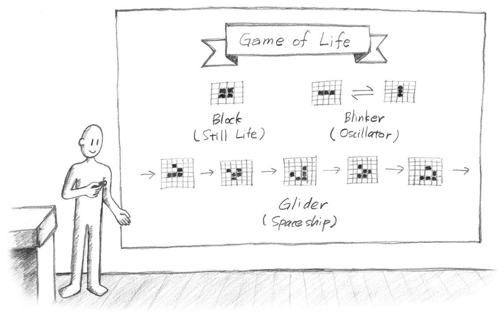

# conways-life-interface



## Description

This is a simple interface for the Conway's Game of Life. It is written in next.js and uses the canvas API to draw the
grid.

## Running

To run the project, you need to have node.js installed. Then, you can run the following commands:

```bash
npm install
npm run dev
```